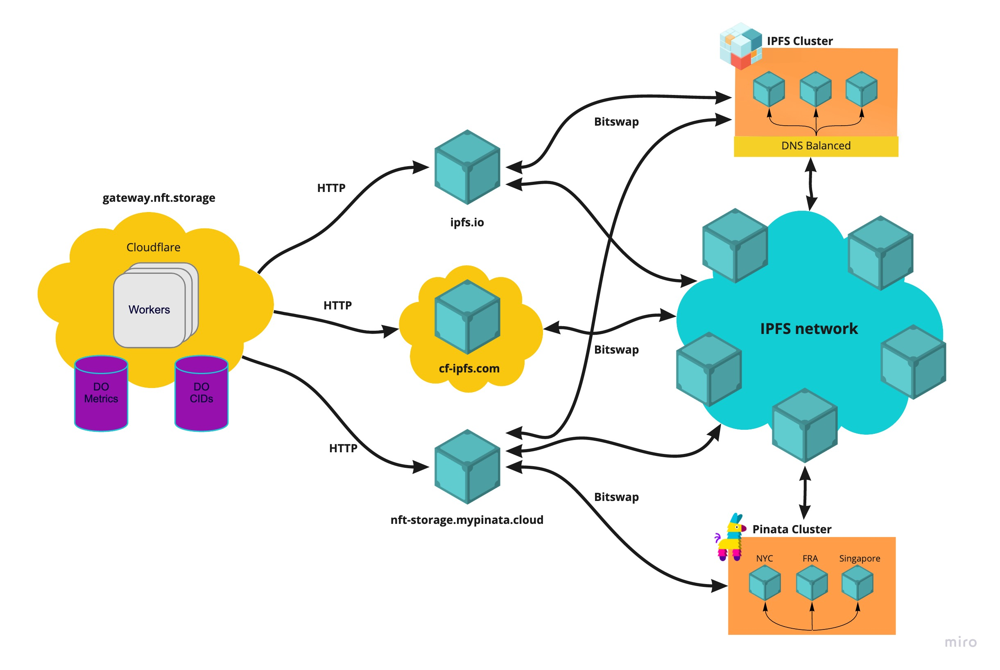

# gateway.nft.storage

> The IPFS gateway for nft.storage.

## Getting started

One time set up of your cloudflare worker subdomain for dev:

- `npm install` - Install the project dependencies
- Sign up to Cloudflare and log in with your default browser.
- `npm i @cloudflare/wrangler -g` - Install the Cloudflare wrangler CLI
- `wrangler login` - Authenticate your wrangler cli; it'll open your browser.
- Copy your cloudflare account id from `wrangler whoami`
- Update `wrangler.toml` with a new `env`. Set your env name to be the value of `whoami` on your system you can use `npm start` to run the worker in dev mode for you.

  [**wrangler.toml**](./wrangler.toml)

  ```toml
  [env.bobbytables]
  workers_dev = true
  account_id = "<what does the `wrangler whoami` say>"
  ```

- Add secrets

  ```sh
    wrangler secret put SENTRY_DSN --env $(whoami) # Get from Sentry (not required for dev)
    wrangler secret put LOGTAIL_TOKEN --env USER # Get from Logtail
  ```

- `npm run publish` - Publish the worker under your env. An alias for `wrangler publish --env $(whoami)`
- `npm start` - Run the worker in dev mode. An alias for `wrangler dev --env $(whoami)

You only need to `npm start` for subsequent runs. PR your env config to the wrangler.toml, to celebrate 🎉

## High level architecture



The IPFS gateway for nft.storage is not "another gateway", but a caching layer for NFT’s that sits on top of existing IPFS public gateways.

## Persistence

Several metrics per gateway are persisted to track the performance of each public gateway over time. Moreover, the list of gateways that have previously fetched successfully a given CID are also persisted.
